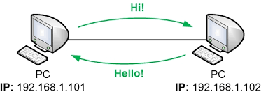

# ip-address
IP address full form = Internet Protocol Address

IP एड्रेस (Internet Protocol Address) एक यूनिक पहचान संख्या है जो हर डिवाइस 
(जैसे कि कंप्यूटर, मोबाइल, सर्वर आदि) को नेटवर्क में जोड़ने और संचार करने के लिए असाइन की जाती है।
 जब हम इंटरनेट का उपयोग करते हैं, तो हमारे डिवाइस का IP एड्रेस नेटवर्क में एक पहचान के रूप में काम करता है।

IP एड्रेस के प्रकार

IP एड्रेस के मुख्य दो प्रकार होते हैं:

    IPv4 (Internet Protocol version 4):
        IPv4 एड्रेस 32-बिट लंबा होता है और इसे चार भागों में विभाजित किया जाता है, प्रत्येक भाग 8 बिट का होता है।
         उदाहरण के लिए, "192.168.1.1" एक IPv4 एड्रेस है।
        
        IPv4 में कुल लगभग 4.3 अरब (4.3 billion) IP एड्रेस हो सकते हैं।
         हालाँकि, इंटरनेट पर डिवाइसेस की बढ़ती संख्या के कारण ये IP एड्रेस समाप्त हो रहे हैं।

    IPv6 (Internet Protocol version 6):
        IPv6 एड्रेस 128-बिट लंबा होता है और इसमें अठारह क्विंटलियन (approximately 3.4×10^38) IP एड्रेस होते हैं।
        IPv6 को मुख्यतः IPv4 एड्रेस समाप्त होने की समस्या को हल करने के लिए डिजाइन किया गया था।
        IPv6 एड्रेस का उदाहरण: 2001:0db8:85a3:0000:0000:8a2e:0370:7334।

IP एड्रेस के प्रकार के अनुसार वर्गीकरण

Public IP Address:
        Public IP एड्रेस का उपयोग इंटरनेट पर किया जाता है और इसे इंटरनेट सर्विस प्रोवाइडर (ISP) द्वारा असाइन किया जाता है।
        यह एड्रेस सभी के लिए सुलभ होता है और इसे सार्वजनिक नेटवर्क में किसी भी डिवाइस से एक्सेस किया जा सकता है।

Private IP Address:
    Private IP एड्रेस का उपयोग एक निजी नेटवर्क (जैसे कि घर या ऑफिस नेटवर्क) में किया जाता है।
   यह एड्रेस इंटरनेट पर सीधे एक्सेस नहीं किया जा सकता और यह केवल उसी नेटवर्क के भीतर डिवाइसेस के बीच संचार में सहायक होता है।
        प्राइवेट IP एड्रेस रेंज कुछ इस प्रकार होती हैं:
            10.0.0.0 से 10.255.255.255 तक
            172.16.0.0 से 172.31.255.255 तक
            192.168.0.0 से 192.168.255.255 तक

Static IP Address:
        Static IP एड्रेस एक स्थायी एड्रेस होता है जिसे बदलने की आवश्यकता नहीं होती।
        आम तौर पर सर्वर या होस्टिंग में स्थिर IP की आवश्यकता होती है, ताकि वह हर समय एक ही एड्रेस पर उपलब्ध हो।

Dynamic IP Address:
        Dynamic IP एड्रेस को नेटवर्क में प्रत्येक नए कनेक्शन के साथ असाइन किया जाता है और यह हर बार बदल सकता है।
        इसे DHCP (Dynamic Host Configuration Protocol) सर्वर द्वारा असाइन किया जाता है 
        और यह घरों या निजी नेटवर्क में सामान्य होता है।

IP एड्रेस का फॉर्मेट और रेंज

    IPv4 एड्रेस को 0 से 255 तक के अंकों में प्रदर्शित किया जाता है। जैसे: 192.168.0.1
    IPv6 एड्रेस को हेक्साडेसिमल (0-9 और a-f) में प्रदर्शित किया जाता है और इसे 8 समूहों में विभाजित किया जाता है।
     जैसे: 2001:0db8:85a3:0000:0000:8a2e:0370:7334

IP एड्रेस का उपयोग

    नेटवर्क कनेक्शन: नेटवर्क पर हर डिवाइस का यूनिक IP एड्रेस होता है जिससे डिवाइसों के बीच डेटा ट्रांसफर किया जा सकता है।
    डेटा ट्रांसमिशन: जब आप इंटरनेट पर किसी वेबसाइट पर जाते हैं, तो आपका IP एड्रेस सर्वर को बताता है कि डेटा कहाँ भेजना है।
    सुरक्षा: IP एड्रेस का उपयोग ट्रैकिंग, फायरवॉल, और एक्सेस नियंत्रण जैसे सुरक्षा उपायों में किया जाता है।

IP एड्रेस की रेंज और वर्ग

    Class A: बड़े नेटवर्क के लिए, रेंज 1.0.0.0 से 126.0.0.0
    Class B: मध्यम आकार के नेटवर्क के लिए, रेंज 128.0.0.0 से 191.255.0.0
    Class C: छोटे नेटवर्क के लिए, रेंज 192.0.0.0 से 223.255.255.0
    Class D: मल्टीकास्टिंग के लिए, रेंज 224.0.0.0 से 239.255.255.255
    Class E: अनुसंधान और प्रयोग के लिए, रेंज 240.0.0.0 से 255.255.255.255

IP एड्रेस को कैसे प्राप्त करें

आप अपने डिवाइस का IP एड्रेस निम्नलिखित कमांड से देख सकते हैं:

    Windows: ipconfig
    Linux/Mac: ifconfig या ip addr

IP एड्रेस हर डिवाइस को नेटवर्क पर एक यूनिक पहचान प्रदान करता है, जिससे डिवाइसें आसानी से डेटा एक्सचेंज कर पाती हैं।
 इंटरनेट की बढ़ती जरूरतों को पूरा करने के लिए IP एड्रेस का महत्व बढ़ रहा है।

                       *IPv4*

ChatGPT said:
ChatGPT

IPv4 (Internet Protocol version 4) इंटरनेट प्रोटोकॉल का एक संस्करण है, जो नेटवर्किंग में सबसे पहले इस्तेमाल होने 
वाले IP एड्रेसिंग सिस्टमों में से एक है। यह इंटरनेट प्रोटोकॉल का चौथा संस्करण है, जो आज भी व्यापक रूप से उपयोग में है।
IPv4 एड्रेस 32-बिट एड्रेसिंग सिस्टम का उपयोग करता है, जिससे कुल 4.29 बिलियन (2³²) यूनिक IP एड्रेस बन सकते हैं।

IPv4 एड्रेस की संरचना

IPv4 एड्रेस को चार भागों में विभाजित किया गया है, जो प्रत्येक 8-बिट (1 बाइट) का होता है। 
इसे डॉट-डेसिमल (dot-decimal) प्रारूप में लिखा जाता है, जिसमें हर भाग को 0 से 255 के बीच की संख्या के रूप में दर्शाया जाता है। 
उदाहरण के लिए:    192.168.1.1

यहां प्रत्येक संख्या 8-बिट का प्रतिनिधित्व करती है, जिससे पूरे एड्रेस को 32-बिट मिलते हैं।
IPv4 एड्रेस क्लासेस

IPv4 एड्रेस को पाँच मुख्य वर्गों (Classes) में बांटा गया है:

    Class A:
        रेंज: 1.0.0.0 से 126.0.0.0
        बड़े नेटवर्क के लिए उपयोग किया जाता है।
        पहला ऑक्टेट नेटवर्क आईडी होता है, बाकी तीन होस्ट के लिए।

    Class B:
        रेंज: 128.0.0.0 से 191.255.0.0
        मीडियम साइज़ नेटवर्क के लिए।
        पहले दो ऑक्टेट नेटवर्क के लिए, बाकी होस्ट के लिए।

    Class C:
        रेंज: 192.0.0.0 से 223.255.255.0
        छोटे नेटवर्क्स के लिए।
        पहले तीन ऑक्टेट नेटवर्क के लिए, अंतिम ऑक्टेट होस्ट के लिए।

    Class D:
        रेंज: 224.0.0.0 से 239.255.255.255
        मल्टीकास्ट एड्रेसिंग के लिए।

    Class E:
        रेंज: 240.0.0.0 से 255.255.255.255
        अनुसंधान और भविष्य के उपयोग के लिए आरक्षित।

IPv4 के प्रकार

    पब्लिक IP एड्रेस: इंटरनेट पर डिवाइस की पहचान के लिए इस्तेमाल होता है। इसे इंटरनेट सेवा प्रदाता (ISP) द्वारा प्रदान किया जाता है।
    प्राइवेट IP एड्रेस: यह एक लोकल नेटवर्क के भीतर उपयोग किया जाता है और सार्वजनिक इंटरनेट पर मान्य नहीं होता। 
    उदाहरण के लिए, 192.168.0.0 से 192.168.255.255 प्राइवेट IP रेंज है।

IPv4 एड्रेसिंग की सीमाएँ

IPv4 के पास केवल 4.29 बिलियन यूनिक एड्रेस हैं, जो कि मौजूदा इंटरनेट उपकरणों के लिए अपर्याप्त है। 
बढ़ती डिवाइस कनेक्टिविटी के कारण IPv4 एड्रेस समाप्त होने की स्थिति में आ गया है, 
इसीलिए IPv6 को अपनाया जा रहा है। IPv6 अधिक एड्रेसिंग स्पेस प्रदान करता है, 
जिससे भविष्य में कनेक्टिविटी की जरूरतों को पूरा किया जा सके।
NAT (Network Address Translation)

IPv4 एड्रेस की कमी को पूरा करने के लिए NAT तकनीक का प्रयोग किया जाता है।
यह तकनीक एक सार्वजनिक IP एड्रेस को कई प्राइवेट IP एड्रेस के साथ साझा करने की सुविधा देती है,
जिससे एड्रेस स्पेस का बेहतर उपयोग हो सके।
निष्कर्ष

IPv4 इंटरनेट संचार के लिए बुनियादी और प्राथमिक प्रोटोकॉल है। इसके सीमित एड्रेस स्पेस के कारण IPv6 की जरूरत पड़ी है,
लेकिन IPv4 आज भी बहुत से नेटवर्क और उपकरणों पर व्यापक रूप से उपयोग किया जाता है।                     
    

                       *IPv6*

IPv6 (Internet Protocol version 6) इंटरनेट प्रोटोकॉल का नवीनतम संस्करण है, जो IPv4 की सीमाओं को दूर करने के लिए डिज़ाइन किया गया है। IPv4 के 32-बिट एड्रेस स्पेस की तुलना में, IPv6 128-बिट एड्रेस स्पेस का उपयोग करता है, जिससे यह अधिक एड्रेसिंग क्षमता प्रदान करता है। IPv6 लगभग 340 अनडेसिलियन (3.4 x 10^38) यूनिक IP एड्रेस बना सकता है, जो भविष्य में बढ़ती इंटरनेट कनेक्टिविटी की जरूरतों को पूरा करने के लिए पर्याप्त है।
IPv6 एड्रेस की संरचना

IPv6 एड्रेस 128-बिट लंबा होता है और इसे 8 समूहों में लिखा जाता है, जहां हर समूह 16-बिट का होता है और हेक्साडेसिमल (hexadecimal) फॉर्मेट में दर्शाया जाता है। प्रत्येक समूह को कॉलन (:) से अलग किया जाता है।
 उदाहरण के लिए: 2001:0db8:85a3:0000:0000:8a2e:0370:7334

IPv6 एड्रेस को और भी संक्षेप में लिखा जा सकता है:

    यदि एक समूह में लगातार 0 हैं, तो उन्हें छोड़ा जा सकता है (उदाहरण: :: का उपयोग करके)।
    प्रत्येक समूह में अग्रणी 0 को भी छोड़ा जा सकता है।

संक्षेप में, ऊपर का एड्रेस इस रूप में लिखा जा सकता है:

2001:db8:85a3::8a2e:370:7334

IPv6 के मुख्य लाभ

    बड़ी एड्रेस स्पेस: IPv6 का 128-बिट एड्रेस स्पेस अधिक डिवाइसेस को कनेक्ट करने की अनुमति देता है।
    सिंपल पैकेट हेडर: IPv6 पैकेट हेडर IPv4 से अधिक सरल होता है, जिससे राउटिंग प्रक्रिया अधिक प्रभावी हो जाती है।
    ऑटो-कॉन्फिगरेशन: IPv6 एड्रेस के लिए ऑटो-कॉन्फिगरेशन की सुविधा होती है, जिससे नेटवर्क को मैन्युअल सेटअप की आवश्यकता नहीं होती।
    बिल्ट-इन सिक्योरिटी: IPv6 में IPsec (Internet Protocol Security) को एकीकृत किया गया है, जो डेटा संचार की सुरक्षा सुनिश्चित करता है।
    QoS सपोर्ट: IPv6 Quality of Service (QoS) को सपोर्ट करता है, जो वीडियो और वॉइस ट्रैफिक के लिए बैंडविड्थ प्राथमिकता को बेहतर बनाता है।

IPv6 के प्रकार

IPv6 एड्रेस को तीन मुख्य श्रेणियों में विभाजित किया गया है:

    यूनिकास्ट एड्रेस: यह एक सिंगल डिवाइस को निर्दिष्ट करता है। इसे एक व्यक्ति या डिवाइस को भेजा जाता है।
    मल्टीकास्ट एड्रेस: इसे एक समूह को भेजा जाता है, जहां कई डिवाइसेस एड्रेस से जुड़े होते हैं।
    एनीकास्ट एड्रेस: इसे सबसे नजदीकी डिवाइस को भेजा जाता है, जिससे डेटा का जल्दी वितरण संभव होता है।

IPv6 के विशेष एड्रेस प्रकार

    लिंक-लोकल एड्रेस: यह एक प्राइवेट नेटवर्क के भीतर ऑटो-कॉन्फिगरेशन के लिए उपयोग होता है, जिसका रेंज fe80::/10 से शुरू होता है।
    ग्लोबल यूनिकास्ट एड्रेस: यह इंटरनेट पर पब्लिक एड्रेस के रूप में प्रयोग होता है, जो IPv4 के पब्लिक एड्रेस के समान है।
    यूनिकास्ट एड्रेस: प्रत्येक नेटवर्क पर व्यक्तिगत डिवाइस के लिए होता है।

IPv6 एड्रेसिंग के प्रमुख लाभ

    IPv4 की तुलना में IPv6 में अधिक एड्रेस स्पेस है, जो आधुनिक इंटरनेट की बढ़ती आवश्यकताओं को पूरा करता है।
    NAT (Network Address Translation) की जरूरत नहीं होती, क्योंकि एड्रेसिंग स्पेस पर्याप्त होता है।
    IPv6 से डेटा ट्रांसफर की गति और सुरक्षा में सुधार होता है, और यह ज्यादा आधुनिक नेटवर्क प्रोटोकॉल और सेवाओं के साथ संगत है।

IPv6 में संक्रमण की आवश्यकता क्यों है?

IPv4 के 32-बिट एड्रेस स्पेस ने इंटरनेट पर कनेक्टेड डिवाइसेस की बढ़ती संख्या के कारण IP एड्रेस की कमी की समस्या उत्पन्न की है। IPv6 के विशाल एड्रेसिंग स्पेस से इस समस्या का समाधान होता है और भविष्य में बढ़ती कनेक्टिविटी आवश्यकताओं को पूरा किया जा सकता है।
निष्कर्ष

IPv6 इंटरनेट संचार का भविष्य है, जो बेहतर एड्रेसिंग स्पेस, सुरक्षा और परफॉर्मेंस प्रदान करता है। हालांकि IPv6 के अपनाने की प्रक्रिया धीमी है, लेकिन इसकी आवश्यकता इंटरनेट के विस्तार और नई टेक्नोलॉजीज के कारण बढ़ती जा रही है।

                   IPv4 और IPv6 के बीच मुख्य अंतर
विशेषता	                              IPv4	                                     IPv6
एड्रेस लंबाई	                32-बिट (4.3 बिलियन एड्रेस)	                128-बिट (340 अनडेसिलियन एड्रेस)
एड्रेस फॉर्मेट	              डॉट-डेसिमल फॉर्मेट (जैसे 192.168.1.1)	             हेक्साडेसिमल फॉर्मेट (जैसे 2001:0db8::1)
एड्रेस क्लासेस	             Class A, B, C, D, और E	                 कोई क्लास नहीं, एड्रेस को जरूरत के अनुसार वर्गीकृत किया जाता है
एड्रेस प्रकार	                पब्लिक और प्राइवेट	                     यूनिकास्ट, मल्टीकास्ट, एनीकास्ट और लिंक-लोकल
NAT सपोर्ट	                 आवश्यक, IP एड्रेस की कमी के कारण	           आवश्यक नहीं, IPv6 में एड्रेस पर्याप्त है
ऑटो-कॉन्फिगरेशन             	सपोर्टेड नहीं	                          सपोर्टेड (स्टेटलेस ऑटो-कॉन्फिगरेशन)
सुरक्षा	                  वैकल्पिक (IPsec वैकल्पिक है)	                    बिल्ट-इन (IPsec को IPv6 के साथ अनिवार्य किया गया)
हेडर कॉम्प्लेक्सिटी	            IPv4 हेडर अधिक जटिल है                       	IPv6 हेडर सरल और फास्ट है

